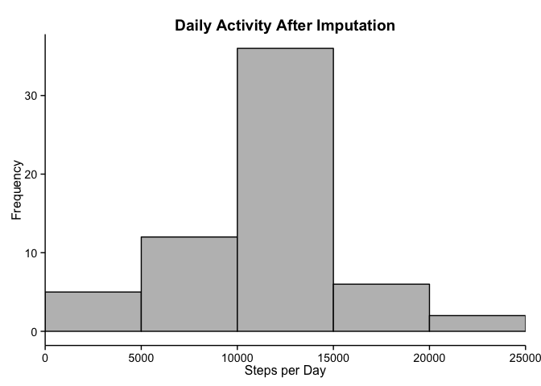

# Reproducible Research: Peer Assessment 1


## Loading and preprocessing the data

First, the data is loaded.


```r
if(!file.exists("activity.csv")){
    url <- "https://d396qusza40orc.cloudfront.net/repdata%2Fdata%2Factivity.zip"
    temp <- tempfile()
    download.file(url, temp, method = "curl")
    unzip(temp, exdir = "." )
    unlink(temp)
}

data <- read.csv("activity.csv")
```

Next, the data is preprocessed into a format suitable for the analysis.

Two changes are made:

* The date variable is transformed into a factor.  
* Missing observations are omitted.


```r
data <- transform(data, date = as.factor(date))

completeData <- data[!is.na(data$steps), ]
```


## What is the mean total number of steps taken per day?

The total number of steps taken per day are calculated.


```r
totalStepsPerDay <- aggregate(completeData$steps, by = list(completeData$date), 
                              sum)
colnames(totalStepsPerDay) <- c("date", "totalSteps")
```

A histogram of the total number of steps taken each day is generated.


```r
require(ggplot2)
```

```
## Loading required package: ggplot2
```

```r
hist <- ggplot(totalStepsPerDay, aes(x = totalSteps))
hist <- hist + geom_histogram(binwidth = 5000, 
                              color = "black", 
                              fill = "grey")
hist <- hist + coord_cartesian(xlim = c(0, 25000))
hist <- hist + labs(title = "Daily Activity",
                    x = "Steps per Day", 
                    y = "Frequency")
hist <- hist + theme_classic()
hist <- hist + theme(plot.title = element_text(size = rel(1.2), 
                                               face = "bold"),
                     axis.title = element_text(size = rel(1)),
                     axis.text = element_text(size = rel(0.9)))
hist
```

 

The mean and median of the total number of steps taken per day are calculated.


```r
meanSteps <- as.integer(round(mean(totalStepsPerDay$totalSteps)))

medianSteps <- median(totalStepsPerDay$totalSteps)
```

The mean is 10766 steps per day and the median is 10765 steps 
per day.


## What is the average daily activity pattern?

In order to observe the average daily activity pattern, the plot below 
illustrates the average number of steps taken, averaged across all days, for 
each 5-minute interval.


```r
intervalSteps <- aggregate(completeData$steps, by = list(completeData$interval), 
                           mean)
colnames(intervalSteps) <- c("interval", "averageSteps")

time <- ggplot(intervalSteps, aes(x = interval, 
                                  y = averageSteps))
time <- time + geom_line()
time <- time + labs(title = "Average Daily Activity",
                    x = "Interval", 
                    y = "Average Number of Steps")
time <- time + theme_classic()
time <- time + theme(plot.title = element_text(size = rel(1.2),
                                               face = "bold"),
                     axis.title = element_text(size = rel(1)),
                     axis.text = element_text(size = rel(1)))
time
```

 

The most active 5-minute interval i.e. the interval with the maximum number of 
steps is calculated.


```r
maxInterval <- intervalSteps$interval[intervalSteps$averageSteps == 
                                          max(intervalSteps$averageSteps)]
```

The most active 5-minute interval is the 835th interval.

## Imputing missing values

The number of missing values are calculated.


```r
countNA <-  nrow(data[is.na(data$steps), ])
```

There are 2304 missing values.  

These missing values are imputed by assuming they should be the mean number 
of steps for that 5-minute interval.


```r
incompleteData <- data[is.na(data$steps), ]
incompleteData <- merge(incompleteData, intervalSteps, by = "interval")
incompleteData$steps <- NULL
colnames(incompleteData)[3] <- "steps"
```

The imputed values are reinserted into the dataset.


```r
fullData <- rbind(completeData, incompleteData)
```

For this new dataset, the daily activity is plotted.


```r
totalStepsPerDay2 <- aggregate(fullData$steps, by = list(fullData$date), sum)
colnames(totalStepsPerDay2) <- c("date", "totalSteps")

hist2 <- ggplot(totalStepsPerDay2, aes(x = totalSteps))
hist2 <- hist2 + geom_histogram(binwidth = 5000, 
                                color = "black", 
                                fill = "grey")
hist2 <- hist2 + coord_cartesian(xlim = c(0, 25000))
hist2 <- hist2 + labs(title = "Daily Activity After Imputation",
                    x = "Steps per Day", 
                    y = "Frequency")
hist2 <- hist2 + theme_classic()
hist2 <- hist2 + theme(plot.title = element_text(size = rel(1.2),
                                                 face = "bold"),
                       axis.title = element_text(size = rel(1)),
                       axis.text = element_text(size = rel(0.9)))
hist2
```

 

The mean and median of the total number of steps taken each day are determined.


```r
meanSteps2 <- as.integer(round(mean(totalStepsPerDay2$totalSteps)))

medianSteps2 <- as.integer(round(median(totalStepsPerDay2$totalSteps)))
```

The mean is 10766 steps per day and the median is 10766 
steps per day. 

After the imputation of the missing values with the mean steps of an interval, 
more observations were added to the 10000 - 15000 steps per day bin of the 
histogram. Therefore, the mean did not change and the median moved closer to 
the mean.


## Are there differences in activity patterns between weekdays and weekends?

To evaluate whether there are differences in activity patterns between weekdays 
and weekends, a new factor variable is created to indicate whether a given date 
is a weekday or weekend day.


```r
fullData <- transform(fullData, date = as.Date(date))

fullData$daytype <- as.factor(sapply(fullData$date, function(x){
    if(weekdays(x) == "Saturday" | weekdays(x) == "Sunday") "weekend" 
    else "weekday"
}))
```


Now it is possible to compare the activity for weekdays vs. weekend 
days.


```r
intervalSteps2 <- aggregate(fullData$steps, by = list(fullData$interval, 
                                                      fullData$daytype), mean)

colnames(intervalSteps2) <- c("interval", "daytype", "averageSteps")

require(lattice)
```

```
## Loading required package: lattice
```

```r
xyplot(averageSteps ~ interval | daytype, 
       data = intervalSteps2, 
       type = "l",
       layout = c(1,2),
       xlab = "Interval",
       ylab = "Average Number of Steps",
       main = "Comparison of Activity Between Weekends and Weekdays")
```

 

There is generally more activity in the mornings of weekdays as compared to 
that of weekends, whereas there is less activity in the afternoons of weekdays 
as compared to that of weekends.


